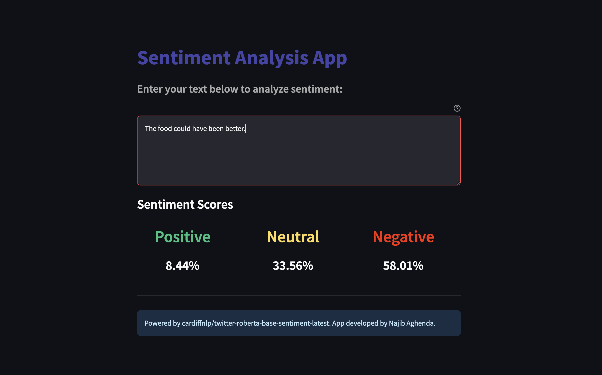

# Sentiment Analysis App

This repository contains a Streamlit web application that uses the `cardiffnlp/twitter-roberta-base-sentiment-latest` model to analyze the sentiment of text.



## Setup

### Running Locally

1. Clone the repository:

   ```sh
   git clone https://github.com/confused-pandas/sentiment-analysis-app.git
   cd sentiment-analysis-app

2. Build the image:
    ```sh
    docker build -t "sentiment-analysis-app" .

3. Run the image
    ```sh
    docker run -p 8501:8501 sentiment-analysis-app